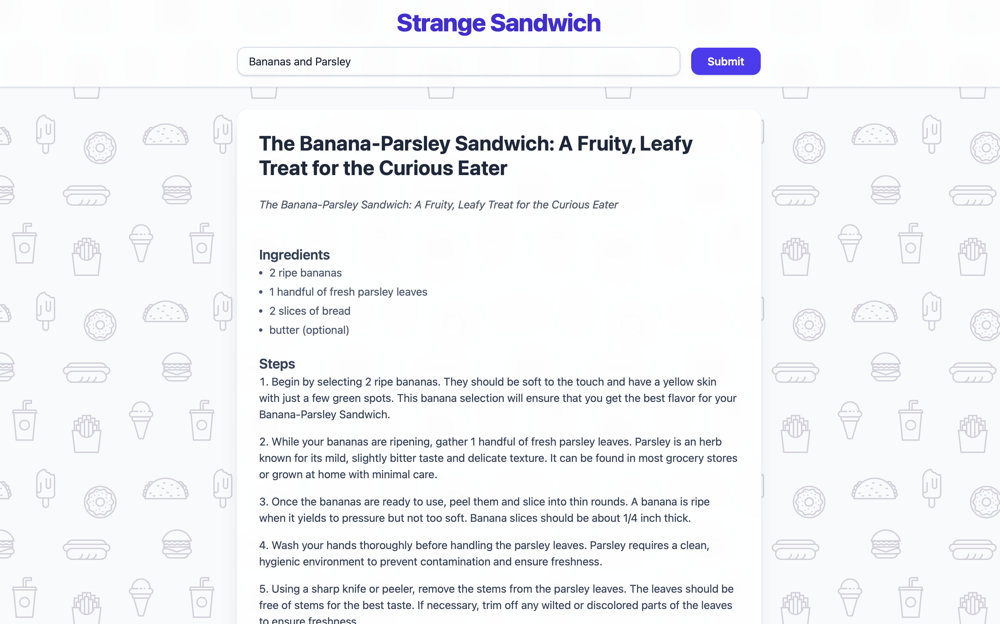

# Strange Sandwich



Strange Sandwich is a demo project showcasing a modern Rust full-stack setup:

- **Tauri** for building a cross-platform desktop app
- **Sycamore** for reactive web UI (compiled to WebAssembly)
- **Tailwind CSS v4** for utility-first styling
- **Ollama** for local LLM (language model) integration

## Features
- Enter sandwich ingredients and generate creative sandwich recipes using an LLM
- Beautiful, responsive UI with Tailwind CSS and heropattern backgrounds
- Desktop app experience powered by Tauri
- All written in Rust (frontend and backend)

## Getting Started

### Prerequisites
- [Rust](https://rustup.rs/) (nightly may be required for Sycamore)
- [Node.js](https://nodejs.org/) and npm (for Tailwind CSS)
- [Ollama](https://ollama.com/) (for local LLM)
- [Tauri CLI](https://tauri.app/v1/guides/getting-started/prerequisites/)

### Setup

1. **Clone the repo:**
   ```sh
   git clone https://github.com/yourusername/strange-sandwich.git
   cd strange-sandwich
   ```
2. **Install Rust dependencies:**
   ```sh
   cargo build
   ```
3. **Install Tailwind CLI:**
   ```
   # Example for macOS arm64
   curl -sLO https://github.com/tailwindlabs/tailwindcss/releases/latest/download/tailwindcss-macos-arm64
   chmod +x tailwindcss-macos-arm64
   mv tailwindcss-macos-arm64 tailwindcss
   ```

   See https://tailwindcss.com/blog/standalone-cli
4. **Run Ollama:**
   ```sh
   ollama serve
   # or as required by your ollama setup
   ```
5. **Run the app (Tauri):**
   ```sh
   cd ui
   cargo tauri dev
   ```

## Project Structure
- `server/` — Rust backend (Warp, OpenAI/Ollama integration) (*Currently unused*)
- `ui/` — Sycamore frontend, Tailwind CSS, Tauri config

## Credits
- [Tauri](https://tauri.app/)
- [Sycamore](https://sycamore-rs.netlify.app/)
- [Tailwind CSS](https://tailwindcss.com/)
- [Ollama](https://ollama.com/)

---

This project is for demo and experimentation purposes. Contributions and feedback welcome!
